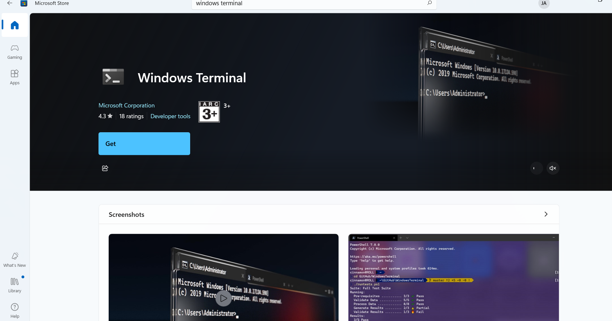

# Developer Environment Setup – DevOps Tools Installation & Workflow Overview

A single, copy-pasteable Markdown guide with clear, step-by-step commands for setting up a Windows development environment.

---

## Table of Contents

1. Opening a terminal
2. Installation of Chocolatey (one-time)
3. Installation of Visual Studio Code (VS Code)
4. Installation of Git
5. Installation of SSH Client, SSH Server, SSH-agent (manual GitHub method)
6. Generate SSH key pair & add to ssh-agent
7. Create a Workspace in VS Code
8. Create a GitHub Account
9. Copy Public Key to GitHub
10. Configure Git (username, email, default branch)
11. Clone a GitHub repository (git clone)
12. Basic Git Workflow (add → commit → push)

---

## **1. Opening a Terminal**

PowerShell (Admin) is used to run required commands on Windows.

- Open PowerShell as Administrator:
**Start → type “PowerShell” → right-click → Run as administrator**


- Install Windows Terminal from Microsoft Store(Optional but recommended)
- Open and run it in Administrator mode.




---

## **2. Installation of Chocolatey (one-time)**

Chocolatey allows installing software using a single command.

Search in browser: `install chocolatey`


Open the official installation page:

[https://chocolatey.org/install#install-step2](https://chocolatey.org/install#install-step2)

Run this in **Administrator PowerShell**:

```powershell
Set-ExecutionPolicy Bypass -Scope Process -Force; `
[System.Net.ServicePointManager]::SecurityProtocol = `
[System.Net.ServicePointManager]::SecurityProtocol -bor 3072; `
iex ((New-Object System.Net.WebClient).DownloadString('https://community.chocolatey.org/install.ps1'))
```

Verify installation

```powershell

choco -v
```

## **3. Installation of virtual studio code(VS code)**

---
VS Code is a source-code editor used by developers to write, edit, test, and manage code efficiently.

- Open your web browser and input `install VS code` in the search bar


- [https://code.visualstudio.com/download)](https://code.visualstudio.com/download).
  
Download the version for windows.


- Once downloaded,follow the step by step to install the VS code on your machine.


- Install VS code extension: Remote ssh, Bracket psir color,git graph,material icon theme, github actions, azure terraform,terraform hashicorp, start git bash.


## **4. Installation of GIT**

---

Git is a version control system used to track changes in files and manage code.

- Open your web browser and input `install git` in the search bar


- [https://git-scm.com/install/windows](https://git-scm.com/install/windows).

Download the version for windows.


- Once downloaded,follow the step follow the step to install git on your machine.


- To verify the installation
- Run the following command:
- Administrator: Windows PowerShell

```powershell

git --version
wt --version
```

- Output should be the version for each of the tools installed.


## **5. Installation of SSH Client, SSH Server and SSH-agent** : Installed OpenSSH manually from GitHub

---

The normal Windows installation failed due to OS issues using the proceedure provided with the link [learn microsoft](https://learn.microsoft.com/en-us/windows-server/administration/openssh/openssh_install_firstuse?tabs=gui&pivots=windows-11)

Failed Windows command examples:

```powershell

# Install the OpenSSH Client*
Add-WindowsCapability -Online -Name OpenSSH.Client~~~~0.0.1.0
# Install the OpenSSH Server
Add-WindowsCapability -Online -Name OpenSSH.Server~~~~0.0.1.0
```


---

Recommendation: For DevOps workflows and immediate use, go with manual installation from GitHub — it avoids Windows Update issues which i am facing at the moment with my windows

---

For the Manual installation Visit: [Official Manual Download (GitHub Releases)](https://github.com/PowerShell/Win32-OpenSSH/releases.). Ensure to download the lastest one


- Extract OpenSSH ZIP to C:\Program Files\OpenSSH : Right-click the file you downloaded → Extract All

- Move the folder to the correct location → C:\Program Files\OpenSSH


- Run installation script (Admin Powershell)

```powershell

cd "C:\Program Files\OpenSSH"
powershell.exe -ExecutionPolicy Bypass -File install-sshd.ps1
```


### NB: This installs ssh.exe,sshd.exe,ssh-agent,ssh server service

- Enable SSH server:

```powershell

Set-Service sshd -StartupType Automatic
Start-Service sshd
```

- Enable SSH Agent:

```powershell

Set-Service ssh-agent -StartupType Automatic
Start-Service ssh-agent
```

- Allow through Windows Firewall

```powershell

New-NetFirewallRule -Name sshd -DisplayName "OpenSSH Server" -Enabled True -Direction Inbound -Protocol TCP -Action Allow -LocalPort 22

```

- Verify OpenSSH Installation,

```powershell

# Check SSH client
ssh -V

# Check SSH server status
Get-Service sshd
```


- Test SSH

>powershell
>>
> *ssh localhost*

- If it connects → OpenSSH is working perfectly. If it asks for a password → generate SSH keys for passwordless login (recommended for DevOps workflows).
Manual installation from GitHub fully works.


## **6.  Generate SSH key pair & add to ssh-agent**

- [Visit](https://learn.microsoft.com/en-us/windows-server/administration/openssh/openssh_keymanagement) & follow the proceedure to generate SSH key pair & add to ssh-agent


- Generate SSH key

```powershell

ssh-keygen
```


- Generate key (press Enter to accept defaults; choose a passphrase or leave blank):

```powershell

ssh-keygen -t ed25519 -C "<your_email@example.com>"

```

- Add key to ssh-agent

```powershell

ssh-add $env:USERPROFILE\.ssh\id_ed25519
```

Explanations: ssh-keygen makes two files: id_ed25519 (private — never share) and id_ed25519.pub (public — we will copy this to GitHub).


- ssh-add loads the key to ssh-agent.

- Copy public key to clipboard: 

```powershell

Get-Content $env:USERPROFILE\.ssh\id_ed25519.pub | clip
```

- Now the public key is on your clipboard and ready to paste into GitHub

## **7. Create a Workspace in VS Code**

- Open VS Code

- Press Ctrl + Shift + P → “Create New Folder”

- Create folder devops-workspace

- Go to File → Open Folder → Select it

## **8. Create a GitHub Account**

- Create a GitHub Account

- Go to: [github.com](https://github.com)

- Click Sign Up

- Create username, email, password

## **9. Copy Public Key to GitHub**

- Copy Public Key to GitHub

- To get public key, run the provided command on powershell (Admin):

```powershell

cat ~/.ssh/id_ed25519.pub
```

- Verify account

- Then:

- Go to GitHub → Settings

- SSH and GPG Keys → New SSH Key

- Paste key → Save

## **10. Configure Git (username, email, and default branch)**

```powerShell

git config --global user.name "Your Name"
git config --global user.email "<your_email@example.com>"
git config --global init.defaultBranch main
```

- Check settings

```powershell

> git config --list
```

## **11. Clone a GitHub repository (git clone)**

- If you already created a repo on GitHub (via the website), copy the SSH clone URL

```powershell

git@github.com>:username/repo.git
```

- In your project/workspace folder; run the following command on powershell:

```powershell

cd C:\Users\YourUser\projects
git clone git@github.com>:username/repo.git
cd repo

```

- Open that folder in VS Code: code . or use File → Open Folder. If the repo uses main or master, git clone will pick thagitt up.

## **12. Basic Git Workflow (add → commit → push)**

```powershell

git add .
git commit -m "your message"
git push

```
